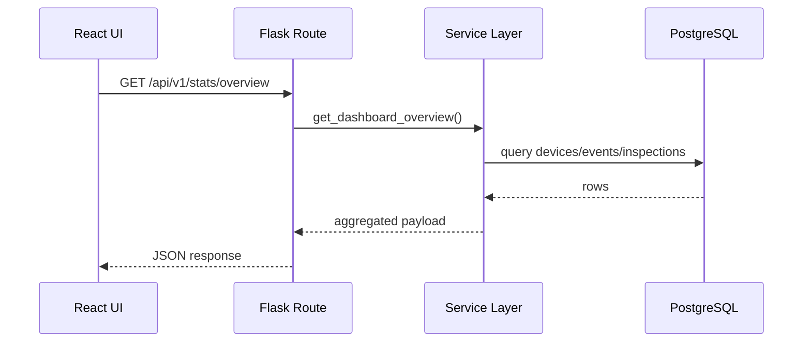
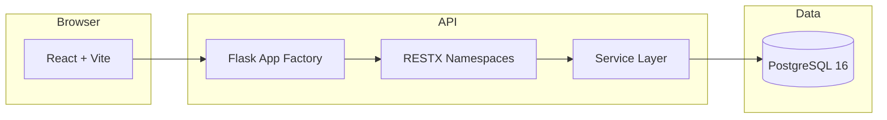

# Architecture

## High-level layering

The project follows a deliberate separation of concerns:

- `models/`: persistence structure
- `schemas/`: request parsing and serialization
- `services/`: business logic
- `routes/`: thin HTTP controllers
- `frontend/src/pages/`: page composition
- `frontend/src/hooks/`: API-bound query hooks

## Request flow



## Repository map

```text
vision-data-dashboard/
|-- backend/
|   |-- app/
|   |   |-- models/
|   |   |-- routes/
|   |   |-- schemas/
|   |   |-- services/
|   |-- migrations/
|   |-- requirements.txt
|-- frontend/
|   |-- src/
|   |   |-- components/
|   |   |-- hooks/
|   |   |-- lib/
|   |   |-- pages/
|   |   |-- types/
|-- docs/
|-- docker-compose.yml
|-- mkdocs.yml
```

## Why this structure

### Backend

Routes stay intentionally thin so that:

- request parsing remains simple
- business logic is testable outside HTTP concerns
- domain changes do not force route rewrites

### Frontend

The frontend is organized around:

- page-level route composition
- reusable chart/layout primitives
- React Query hooks for API reads
- shared domain types mirroring backend payloads

## Runtime topology


