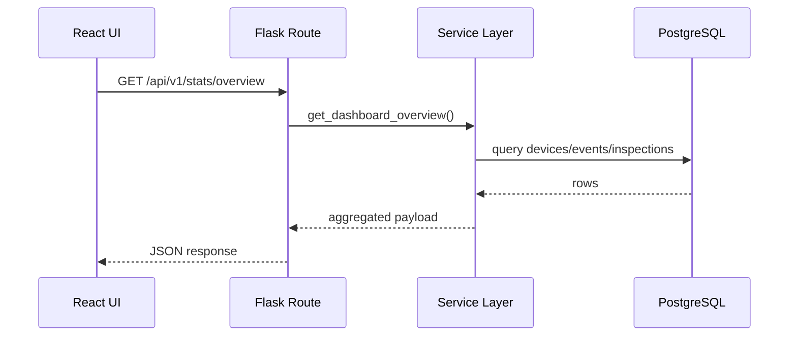
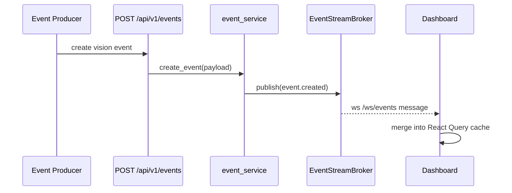
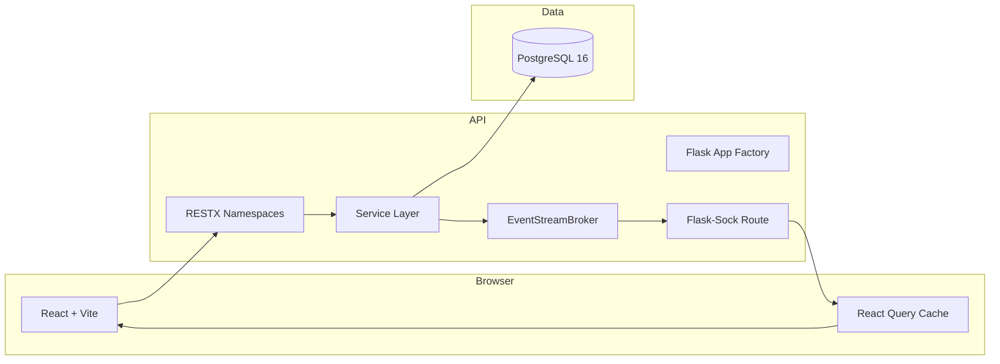

# Architecture

## High-level layering

The project follows a deliberate separation of concerns:

- `models/`: persistence structure
- `schemas/`: request parsing and serialization
- `services/`: business logic
- `routes/`: thin HTTP and WebSocket controllers
- `frontend/src/pages/`: page composition
- `frontend/src/hooks/`: API-bound query hooks and realtime hooks

## REST request flow



## Realtime event flow



## Repository map

```text
vision-data-dashboard/
|-- backend/
|   |-- app/
|   |   |-- models/
|   |   |-- routes/
|   |   |-- schemas/
|   |   |-- services/
|   |-- migrations/
|   |-- tests/
|   |-- requirements.txt
|   |-- requirements-dev.txt
|-- frontend/
|   |-- src/
|   |   |-- components/
|   |   |-- hooks/
|   |   |-- lib/
|   |   |-- pages/
|   |   |-- test/
|   |   |-- types/
|-- docs/
|-- .github/workflows/
|-- docker-compose.yml
|-- mkdocs.yml
```

## Why this structure

### Backend

Routes stay intentionally thin so that:

- request parsing remains simple
- business logic is testable outside HTTP concerns
- auth and live stream behavior stay centralized in services

### Frontend

The frontend is organized around:

- page-level route composition
- reusable chart and layout primitives
- React Query hooks for REST reads
- a dedicated live stream hook for dashboard updates
- shared domain types mirroring backend payloads

## Runtime topology


