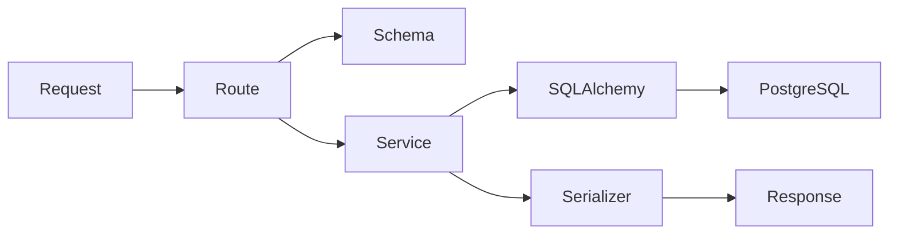

# Backend

## Stack

- Flask 3
- Flask-RESTX
- SQLAlchemy 2.0
- Flask-Migrate / Alembic
- Marshmallow
- Flask-JWT-Extended
- PostgreSQL via `psycopg`

## App factory

The backend starts from:

- `backend/app/__init__.py`
- `backend/wsgi.py`

Responsibilities of the app factory:

- load config
- initialize extensions
- register namespaces
- register error handlers
- expose CLI commands like `flask seed`

## Extension layer

`backend/app/extensions.py` centralizes:

- `db`
- `migrate`
- `jwt`

This keeps setup logic out of model and route files.

## Route design

Routes are intentionally thin:

- `routes/devices.py`
- `routes/events.py`
- `routes/inspections.py`
- `routes/stats.py`
- `routes/auth.py`

Their job is only to:

- parse HTTP input
- call services
- return serialized responses

## Service design

Business logic lives in:

- `services/device_service.py`
- `services/event_service.py`
- `services/inspection_service.py`
- `services/stats_service.py`
- `services/seed_service.py`

This is where:

- queries are built
- aggregates are calculated
- seeds are generated
- dashboard rollups are assembled

## Validation and serialization

The project uses Marshmallow-backed parser/serializer modules in:

- `schemas/common.py`
- `schemas/auth.py`
- `schemas/device.py`
- `schemas/event.py`
- `schemas/inspection.py`

These files handle:

- request body validation
- query parameter validation
- UUID parsing
- datetime normalization
- response serialization

## Backend flow

## Auth mode

Write endpoints support optional protection:

- disabled by default for local dev through `AUTH_REQUIRED=false`
- can accept JWT or `X-API-Key`

The token issue endpoint lives at:

- `POST /api/v1/auth/token`
