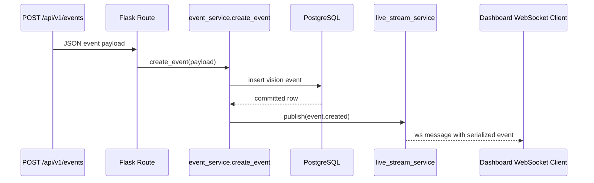
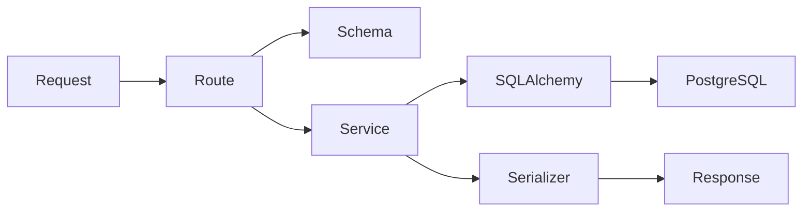

# Backend

## Stack

- Flask 3
- Flask-RESTX
- Flask-Sock
- SQLAlchemy 2.0
- Flask-Migrate / Alembic
- Marshmallow
- Flask-JWT-Extended
- PostgreSQL via `psycopg`

## App factory

The backend starts from:

- `backend/app/__init__.py`
- `backend/wsgi.py`

Responsibilities of the app factory:

- load config
- initialize extensions
- register REST namespaces
- register the WebSocket stream route
- register error handlers
- expose CLI commands like `flask seed`, `flask db-create`, `flask db-reset`, and `flask db-delete`

## Extension layer

`backend/app/extensions.py` centralizes:

- `db`
- `migrate`
- `jwt`
- `sock`

This keeps setup logic out of model and route files.

## Route design

Routes are intentionally thin:

- `routes/devices.py`
- `routes/events.py`
- `routes/inspections.py`
- `routes/stats.py`
- `routes/auth.py`
- `routes/stream.py`

Their job is only to:

- parse HTTP input
- call services
- return serialized responses

## Service design

Business logic lives in:

- `services/device_service.py`
- `services/event_service.py`
- `services/inspection_service.py`
- `services/stats_service.py`
- `services/seed_service.py`
- `services/db_admin_service.py`
- `services/auth_service.py`
- `services/live_stream_service.py`

This is where:

- queries are built
- aggregates are calculated
- seeds are generated
- dashboard rollups are assembled
- auth contexts are resolved
- event notifications are broadcast to subscribers

## Validation and serialization

The project uses Marshmallow-backed parser/serializer modules in:

- `schemas/common.py`
- `schemas/auth.py`
- `schemas/device.py`
- `schemas/event.py`
- `schemas/inspection.py`

These files handle:

- request body validation
- query parameter validation
- UUID parsing
- datetime normalization
- response serialization

## Auth model

Write endpoints support a hardened mode controlled through config:

- `AUTH_REQUIRED`
- `AUTH_ALLOW_LOCAL_BYPASS`
- `ADMIN_API_KEYS`
- `JWT_ACCESS_TOKEN_EXPIRES_MINUTES`
- `JWT_ISSUER`
- `JWT_AUDIENCE`

Behavior:

- local development can bypass auth with `AUTH_REQUIRED=false`
- hardened mode requires `X-API-Key` or a JWT
- `POST /api/v1/auth/token` issues a JWT with the `dashboard:write` scope
- `GET /api/v1/auth/me` returns the resolved principal, method, scopes, and expiration

## Realtime flow

Every newly created vision event is serialized and published through the in-process broker.



## Backend flow



## Test coverage

The backend test suite currently validates:

- Marshmallow schema parsing rules
- JWT and API key auth flows
- live stream broker publish/subscribe behavior

Run it with:

```bash
cd backend
.venv\Scripts\pytest
```
