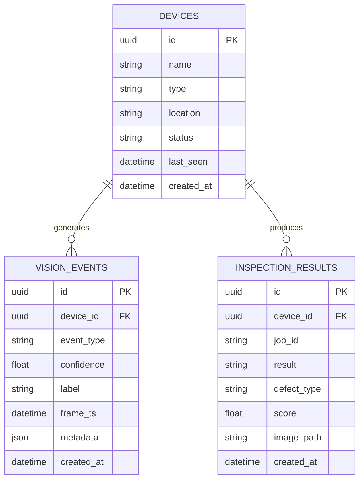

# Database and Migrations

## Short answer

Yes: table and column creation is defined in Python for PostgreSQL.

The project does **not** rely on an `init.sql` bootstrap file for the schema.

## Where the schema lives

### 1. SQLAlchemy models

The domain structure is declared in Python classes:

- `backend/app/models/device.py`
- `backend/app/models/event.py`
- `backend/app/models/inspection.py`

These files define:

- table names
- column types
- primary keys
- foreign keys
- enums
- relationships

### 2. Alembic migration

The actual database evolution is also defined in Python:

- `backend/migrations/versions/20260325_0001_initial_schema.py`

That migration creates:

- `devices`
- `vision_events`
- `inspection_results`
- indexes
- PostgreSQL enum-backed columns through SQLAlchemy/Alembic types

## Entity relationship view



## Migration workflow

Apply schema changes:

```bash
flask db upgrade
```

If you later change a model and want a new migration:

```bash
flask db migrate -m "describe the change"
flask db upgrade
```

## Python database admin commands

The project now includes Python CLI commands for PostgreSQL lifecycle management.

These are registered from the Flask app and implemented in:

- `backend/app/services/db_admin_service.py`

Available commands:

```bash
flask db-create
flask db-reset --yes-i-know
flask db-delete --yes-i-know
```

Behavior:

- `db-create` creates the PostgreSQL database if it does not exist and can apply migrations
- `db-reset` drops the target database, recreates it, runs migrations, and can reseed it
- `db-delete` drops the target database completely

The admin connection uses:

- `POSTGRES_ADMIN_DB`

Default:

```text
postgres
```

## Seeder behavior

The repository includes a Python seed flow in:

- `backend/app/services/seed_service.py`

Important notes:

- `flask seed` seeds only if the database is empty
- `flask seed --truncate` clears app data and reseeds it
- Docker startup uses `flask seed` and no longer resets data on every boot

## What is not used

The schema is not maintained through:

- `init.sql`
- raw SQL reset scripts
- ad hoc shell-only reset logic

That was an explicit design correction to keep PostgreSQL schema ownership in Python/Alembic.
