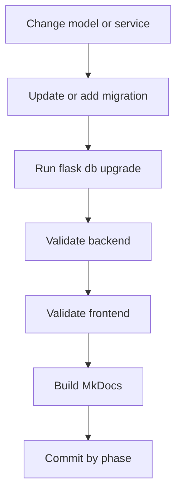

# Development Workflow

## Daily commands

### Environment

```bash
cp .env.example .env
```

### Start full stack

```bash
make dev
```

### Stop full stack

```bash
make down
```

### Create PostgreSQL database

```bash
make db-create
```

### Reset PostgreSQL database

```bash
make db-reset
```

### Delete PostgreSQL database

```bash
make db-delete
```

### Run migrations

```bash
make migrate
```

### Seed data

```bash
make seed
```

### Reset and reseed

```bash
make seed-reset
```

### Serve docs

```bash
make docs-install
make docs-serve
```

## Suggested change flow



## What to change when

### Schema change

Touch:

- `backend/app/models/`
- `backend/migrations/versions/`

### API change

Touch:

- `backend/app/routes/`
- `backend/app/services/`
- `backend/app/schemas/`

### Frontend data change

Touch:

- `frontend/src/types/models.ts`
- `frontend/src/lib/api.ts`
- `frontend/src/hooks/`
- `frontend/src/pages/`

### Documentation change

Touch:

- `README.md`
- `mkdocs.yml`
- `docs/`

## Validation checklist

- [ ] Backend imports compile
- [ ] Frontend builds successfully
- [ ] Migrations apply against PostgreSQL
- [ ] Database lifecycle commands are available from Flask CLI
- [ ] Swagger reflects the API
- [ ] Docs build with `mkdocs build --strict`
