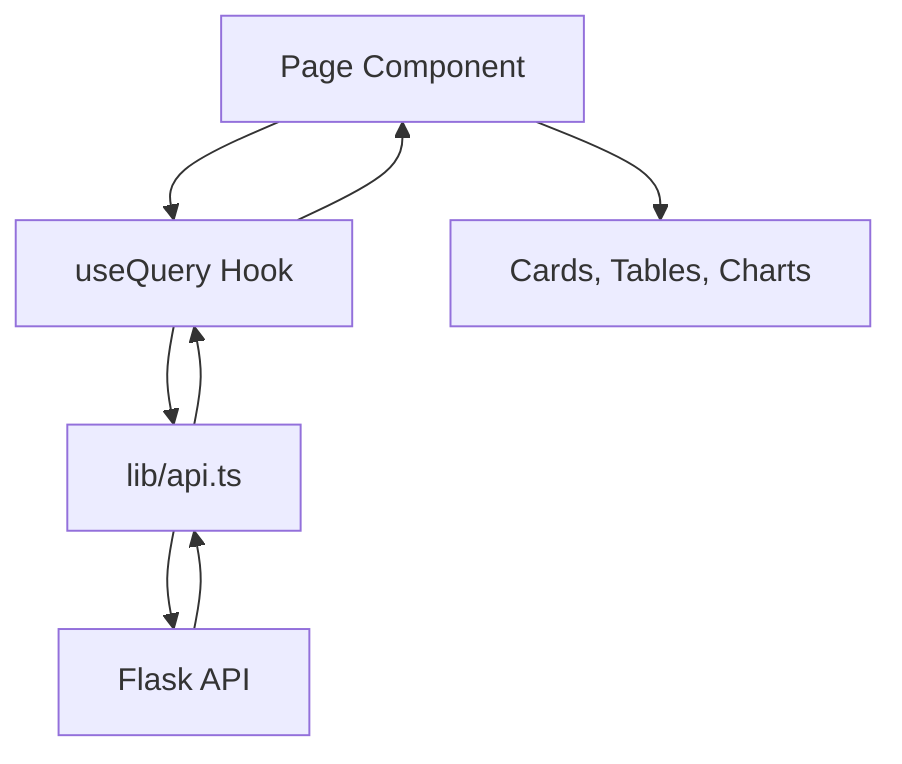

# Frontend

## Stack

- React 18
- TypeScript strict mode
- Vite
- Tailwind CSS
- shadcn/ui-style base setup
- React Query
- Recharts
- Radix Slot support for UI primitives

## Main UI sections

The application exposes four routes:

- `/` dashboard overview
- `/devices` fleet status and device detail
- `/events` event log and confidence histogram
- `/inspections` inspection records and quality trend

## Frontend structure

- `src/pages/`: route pages
- `src/components/layout/`: app shell and stat cards
- `src/components/charts/`: Recharts wrappers
- `src/components/ui/`: shadcn-style UI primitives
- `src/hooks/`: React Query data hooks
- `src/lib/api.ts`: axios client and fetch functions
- `src/types/models.ts`: shared frontend domain types
- `components.json`: shadcn registry-style component config

## Data flow

## Key design choices

### Shared domain types

Frontend types mirror backend responses so pages stay typed end to end.

### Query hooks

React Query handles:

- refetch intervals
- cache keys
- loading/error states

### Lazy route loading

Main pages are lazy-loaded from `src/App.tsx` to reduce the initial bundle size.

## Visual language

The UI intentionally avoids generic dashboard defaults:

- sand and paper background tones
- teal and ember accents
- mono labels for telemetry flavor
- rounded panel layout
- chart-heavy operational presentation
