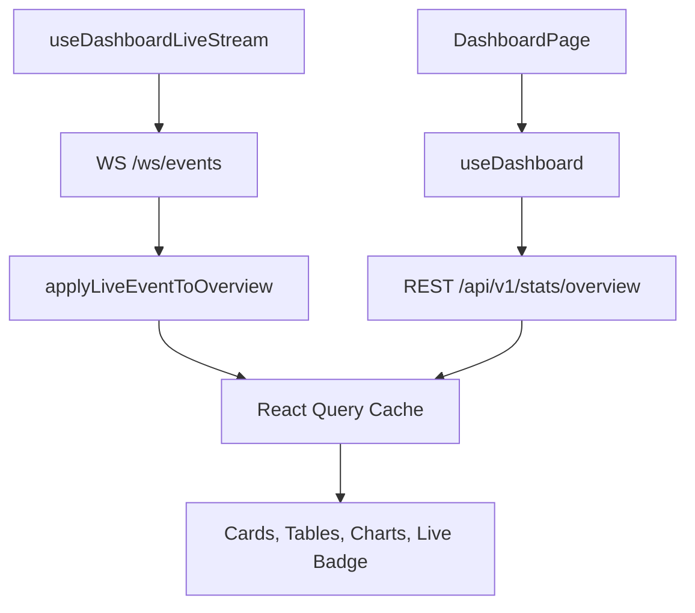

# Frontend

## Stack

- React 18
- TypeScript strict mode
- Vite
- Tailwind CSS
- shadcn/ui-style base setup
- React Query
- Recharts
- Radix Slot support for UI primitives
- Vitest + Testing Library

## Main UI sections

The application exposes four routes:

- `/` dashboard overview
- `/devices` fleet status and device detail
- `/events` event log and confidence histogram
- `/inspections` inspection records and quality trend

## Frontend structure

- `src/pages/`: route pages
- `src/components/layout/`: app shell and stat cards
- `src/components/charts/`: Recharts wrappers
- `src/components/ui/`: shadcn-style UI primitives
- `src/hooks/`: React Query data hooks and the dashboard live stream hook
- `src/lib/api.ts`: axios client and fetch functions
- `src/lib/live-stream.ts`: WebSocket URL helpers and cache merge logic
- `src/types/models.ts`: shared frontend domain types
- `components.json`: shadcn registry-style component config

## Data flow



## Key design choices

### Shared domain types

Frontend types mirror backend responses so pages stay typed end to end.

### Query hooks

React Query handles:

- cache keys
- loading and error states
- periodic refetch fallback
- cache updates after live stream messages

### Lazy route loading

Main pages are lazy-loaded from `src/App.tsx` to reduce the initial bundle size.

### Live dashboard updates

The overview page uses `useDashboardLiveStream()` to:

- open `ws /ws/events`
- listen for `event.created`
- merge the new event into the cached dashboard overview
- invalidate event and device queries so active pages refresh cleanly

## Test coverage

The frontend suite currently validates:

- utility formatting helpers
- live stream URL and cache merge helpers
- dashboard rendering behavior

Run it with:

```bash
cd frontend
npm run test
```

## Visual language

The UI intentionally avoids generic dashboard defaults:

- sand and paper background tones
- teal and ember accents
- mono labels for telemetry flavor
- rounded panel layout
- chart-heavy operational presentation
