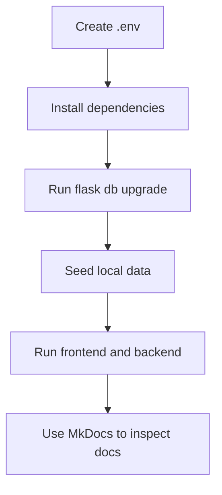

# Getting Started

## Prerequisites

- Python 3.11+
- Node 20+
- Docker Desktop or Docker Engine
- PostgreSQL 16 if running without Docker

## Environment file

Create the root `.env` file from the project example:

```bash
cp .env.example .env
```

Main variables:

| Variable | Purpose |
| --- | --- |
| `POSTGRES_DB` | PostgreSQL database name |
| `POSTGRES_USER` | PostgreSQL user |
| `POSTGRES_PASSWORD` | PostgreSQL password |
| `POSTGRES_HOST` | PostgreSQL host |
| `POSTGRES_PORT` | PostgreSQL port |
| `DATABASE_URL` | SQLAlchemy connection string |
| `VITE_API_BASE_URL` | Frontend API base URL |

## Run with Docker

```bash
make dev
```

Services:

- Frontend: `http://localhost:5173`
- Backend: `http://localhost:5000`
- Swagger: `http://localhost:5000/api/v1/docs`
- PostgreSQL: `localhost:5432`

## Run without Docker

### Backend

```bash
cd backend
python -m venv .venv
.venv\Scripts\activate
pip install -r requirements.txt
flask db upgrade
flask seed
flask run
```

### Frontend

```bash
cd frontend
npm install
npm run dev
```

## Serve the docs

Install doc dependencies:

```bash
python -m pip install -r docs/requirements.txt
```

Start the docs server:

```bash
python -m mkdocs serve
```

Build the docs strictly:

```bash
python -m mkdocs build --strict
```

## Recommended project workflow


