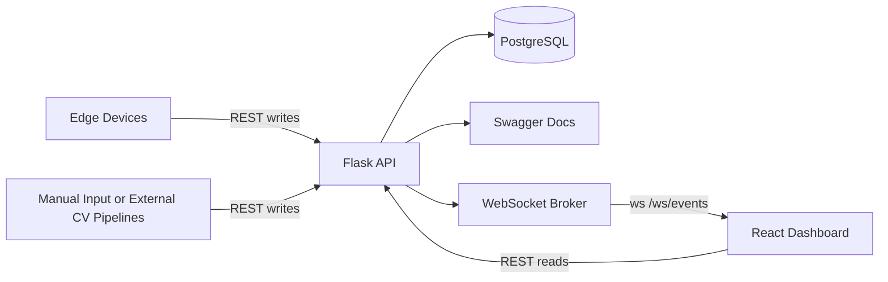

# Vision Data Dashboard

This documentation describes the current implementation of `vision-data-dashboard` as a PostgreSQL-backed full-stack application for:

- device telemetry
- vision event logging
- industrial inspection results
- dashboard-level operational analytics

## What this project is

The repository is intentionally structured like a production-leaning internal platform:

- Flask provides thin REST and WebSocket entry points
- SQLAlchemy models define the domain in Python
- Alembic migrations evolve the PostgreSQL schema
- React + TypeScript renders the operator dashboard
- Docker Compose wires frontend, backend, and PostgreSQL for local development
- GitHub Actions runs backend, frontend, and docs validation in CI

## System overview

## Implementation status

- [x] Backend application factory
- [x] SQLAlchemy models for devices, events, and inspections
- [x] Alembic initial migration in Python
- [x] Seed flow in Python
- [x] Dashboard pages for overview, devices, events, and inspections
- [x] MkDocs documentation
- [x] Python CLI commands for PostgreSQL create/reset/delete workflows
- [x] Auth hardening beyond local optional mode
- [x] WebSocket live stream
- [x] Automated backend/frontend test suites
- [x] CI skeleton

## Important design notes

The database structure is not managed by raw SQL bootstrap scripts.

Instead, it is defined and evolved through Python code:

- models in `backend/app/models/`
- migrations in `backend/migrations/versions/`

Realtime updates are also owned by Python code:

- in-process broker in `backend/app/services/live_stream_service.py`
- WebSocket route in `backend/app/routes/stream.py`
- frontend cache merge logic in `frontend/src/lib/live-stream.ts`

See [Database](database.md), [Backend](backend.md), and [Frontend](frontend.md) for the detailed breakdown.
