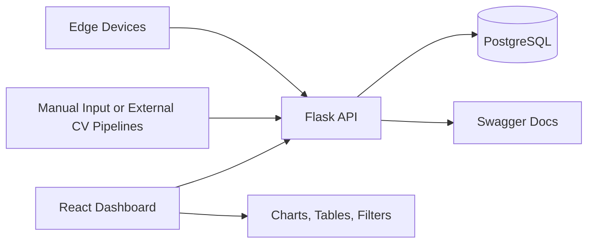

# Vision Data Dashboard

This documentation describes the current implementation of `vision-data-dashboard` as a PostgreSQL-backed full-stack application for:

- device telemetry
- vision event logging
- industrial inspection results
- dashboard-level operational analytics

## What this project is

The repository is intentionally structured like a production-leaning internal platform:

- Flask provides a thin REST API layer
- SQLAlchemy models define the domain in Python
- Alembic migrations evolve the PostgreSQL schema
- React + TypeScript renders the operator dashboard
- Docker Compose wires frontend, backend, and PostgreSQL for local development

## System overview

## Implementation status

- [x] Backend application factory
- [x] SQLAlchemy models for devices, events, and inspections
- [x] Alembic initial migration in Python
- [x] Seed flow in Python
- [x] Dashboard pages for overview, devices, events, and inspections
- [x] MkDocs documentation
- [ ] Auth hardening beyond local optional mode
- [ ] WebSocket live stream
- [ ] Automated backend/frontend test suites

## Important design note

The database structure is not managed by raw SQL bootstrap scripts.

Instead, it is defined and evolved through Python code:

- models in `backend/app/models/`
- migrations in `backend/migrations/versions/`

See [Database](database.md) for the detailed breakdown.
